# 💰 Smart Budgeting — Expense Tracker Web Platform

**Smart Budgeting** is a modern web platform designed to help users stay on top of their finances.  
It allows individuals to log daily expenses, categorize them, and generate insightful reports with data visualizations.  
Built with **Node.js, MongoDB, HTML, CSS, and JavaScript**, the platform provides a secure and user-friendly interface for effective money management.  

---

## ✨ Features

### 🔐 User Authentication & Authorization
- Secure **Sign-up & Login** with hashed passwords (bcrypt)  
- **JWT-based authentication** for safe user sessions  
- Role-based access for **admins and regular users**  

### 💸 Expense Management
- Add, update, and delete expenses with type, product, cost, and date  
- Filter expenses by category for better insights  
- Personalized savings tips based on salary  

### 📊 Data Visualization
- Interactive charts with **Chart.js**  
- Monthly and yearly graphs showing expense trends  
- Real-time updates when new expenses are added or modified  

### 👤 User Profile Management
- View and update personal account details  
- Change password securely  
- Keep user data private and protected  

### 🛠️ Admin Management
- Admins can create, search, update, and delete user accounts  
- Grant/revoke admin roles  
- Full control over the system’s user base  

### 📑 Reports & Analytics
- Monthly and yearly reports for spending analysis  
- Category-based spending breakdowns  
- **Debt-to-Income ratio** calculations  
- Budget allocation suggestions (needs, wants, savings)  

---

## 🧰 Tech Stack
- **Frontend:** HTML, CSS, Chart.js  
- **Backend:** Node.js, Express.js  
- **Database:** MongoDB with Mongoose  
- **Authentication:** JWT & bcrypt.js  
- **Validation:** express-validator  
- **IDE/Tools:** VS Code, MongoDB Compass  

---

## 📱 Screenshots

<p align="center">
  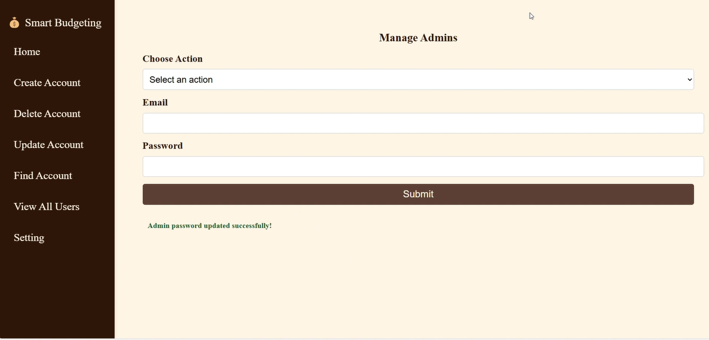
  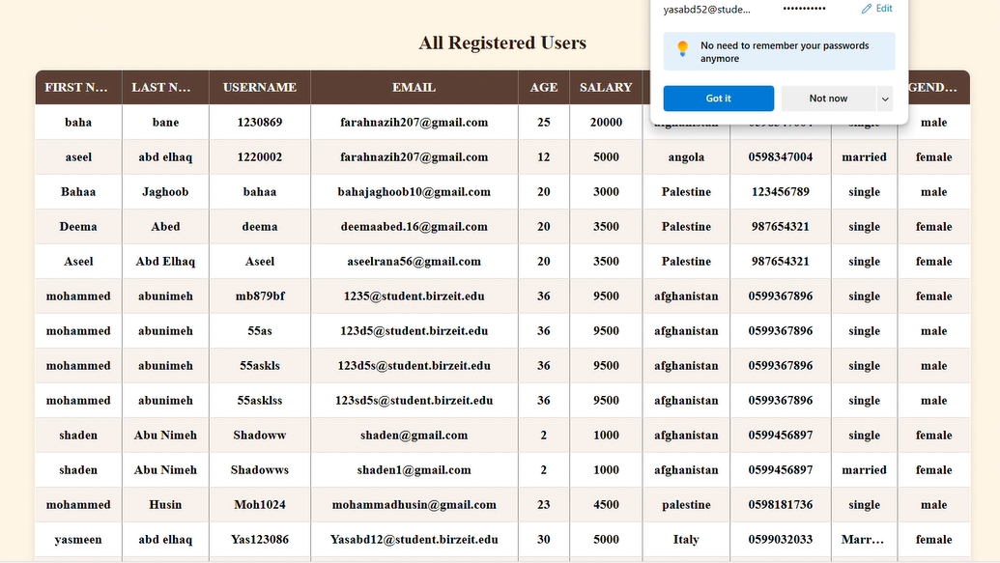
  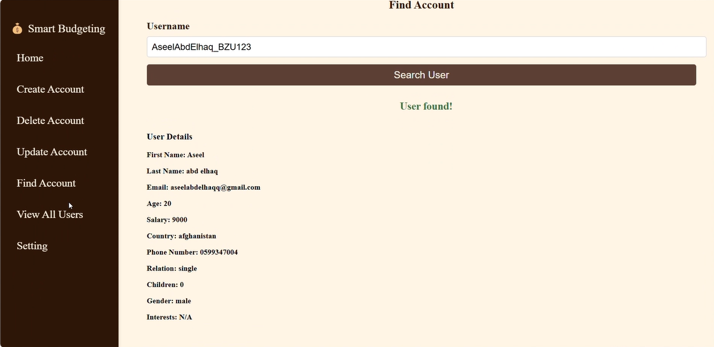
  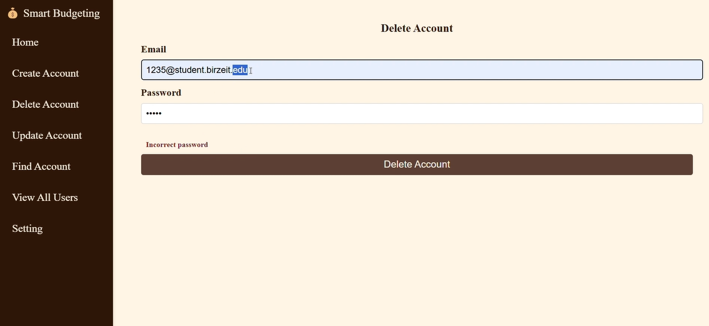
  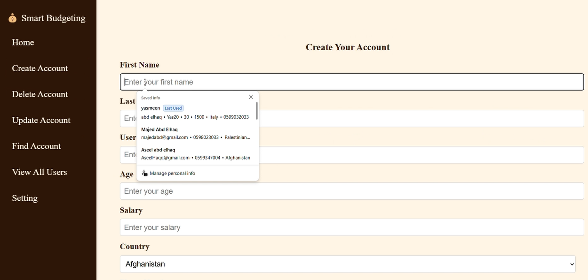
</p>

<p align="center">
  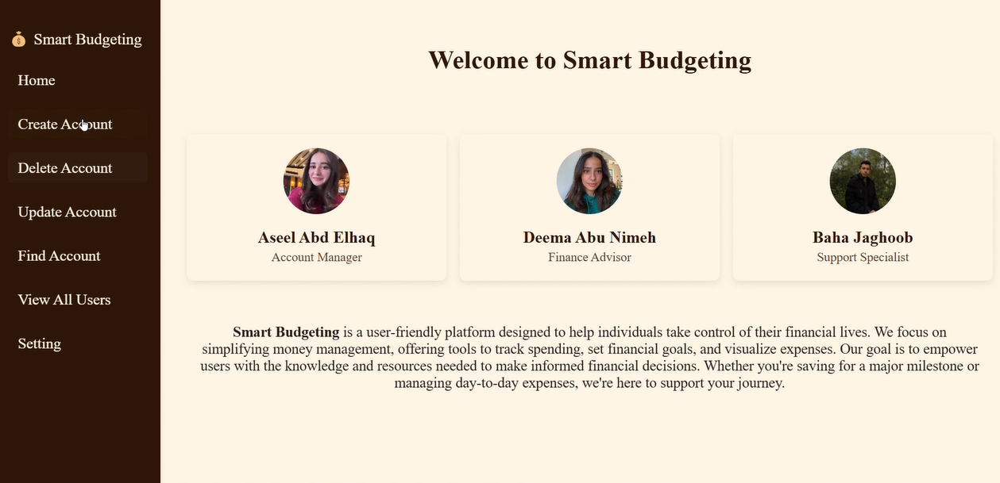
  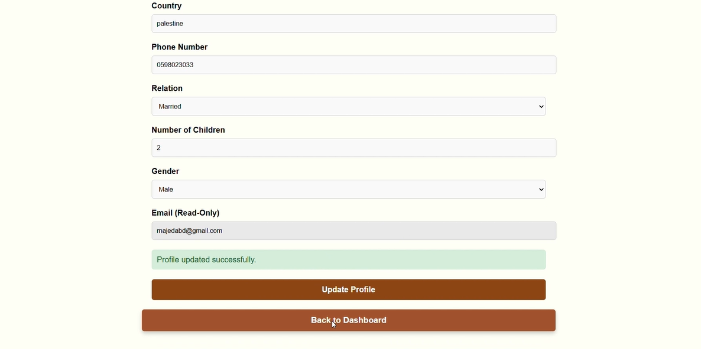
  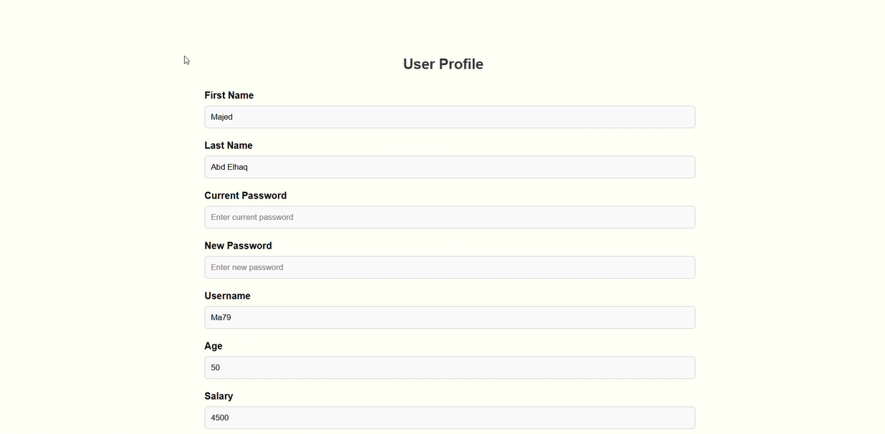
  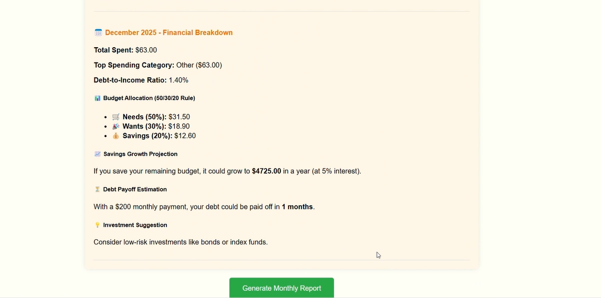
  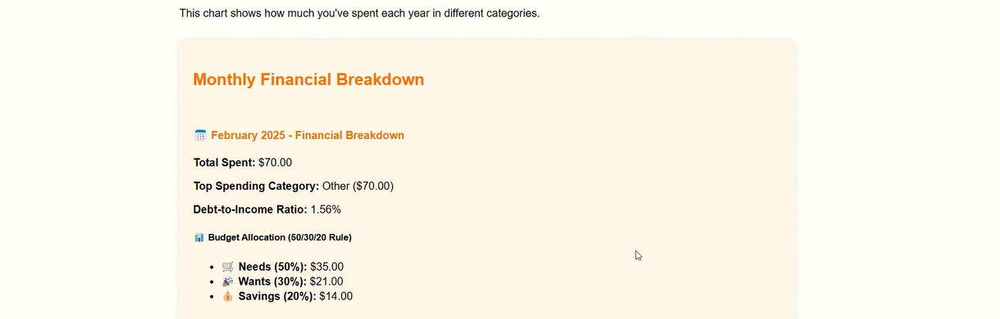
</p>

<p align="center">
  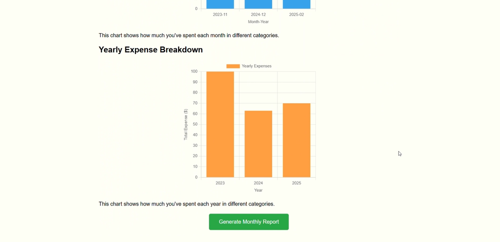
  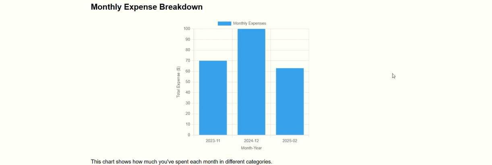
  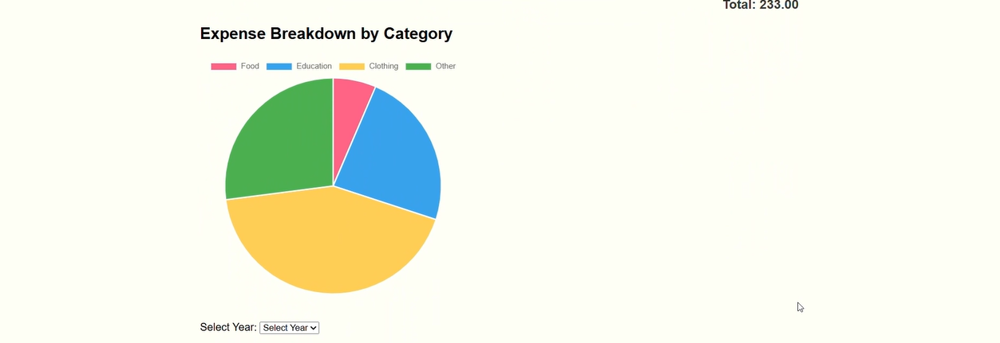
  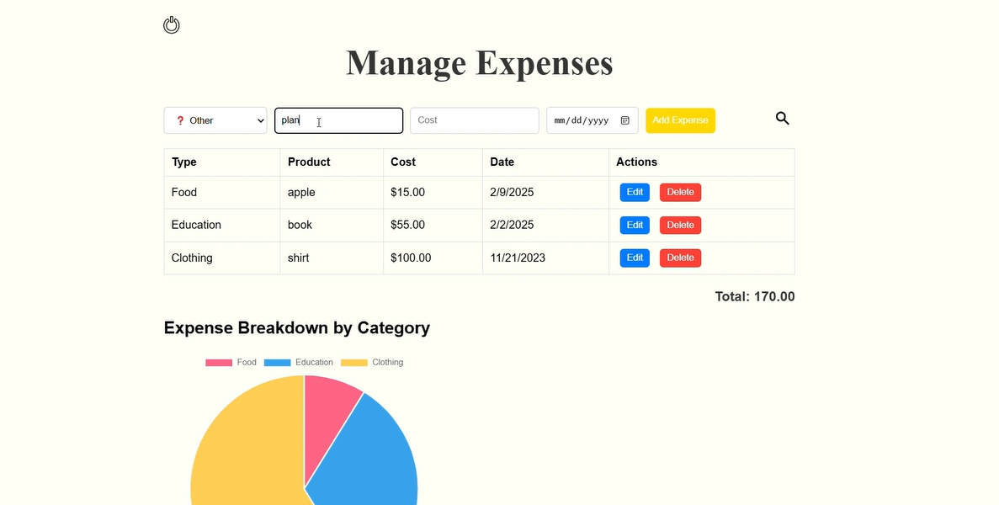
  
</p>

<p align="center">
  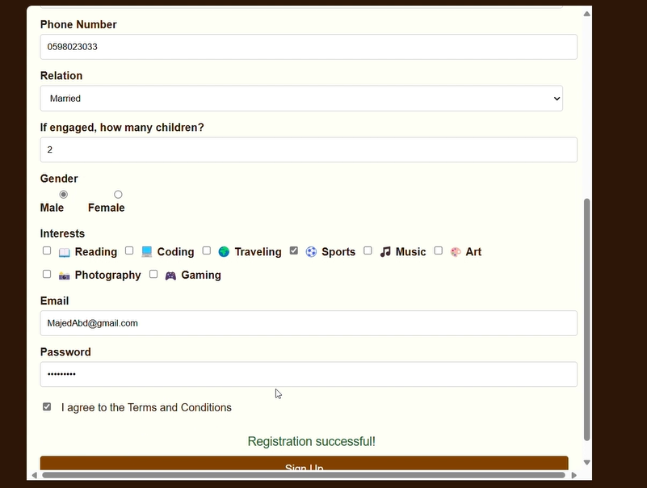
  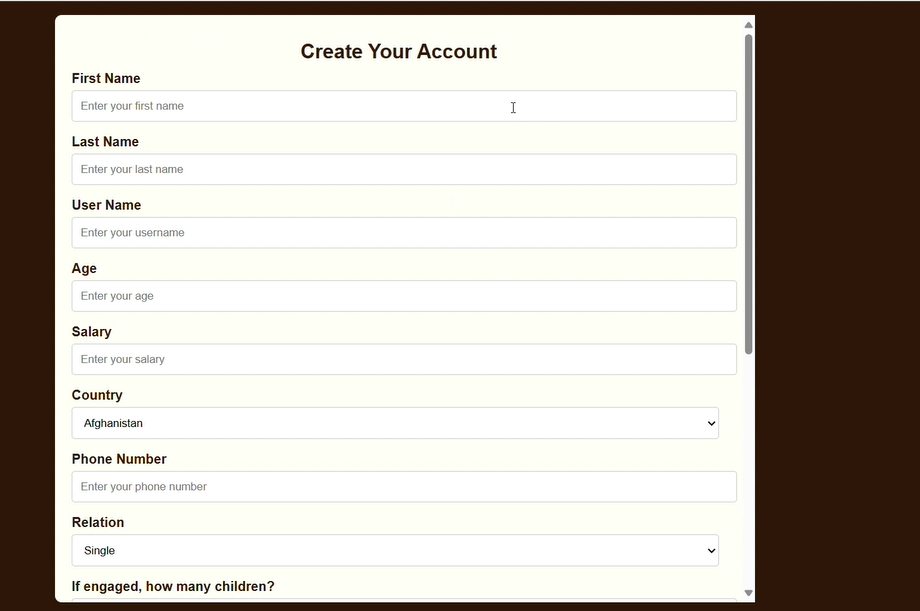
  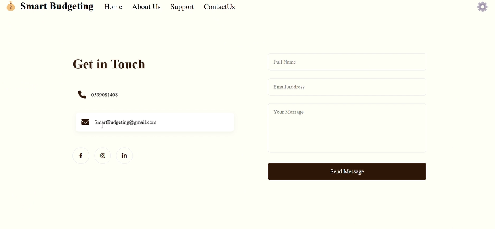
  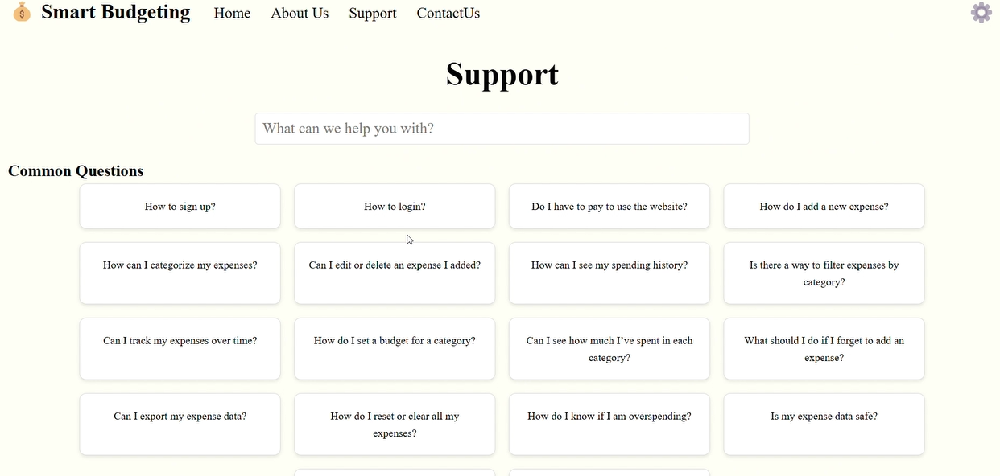
  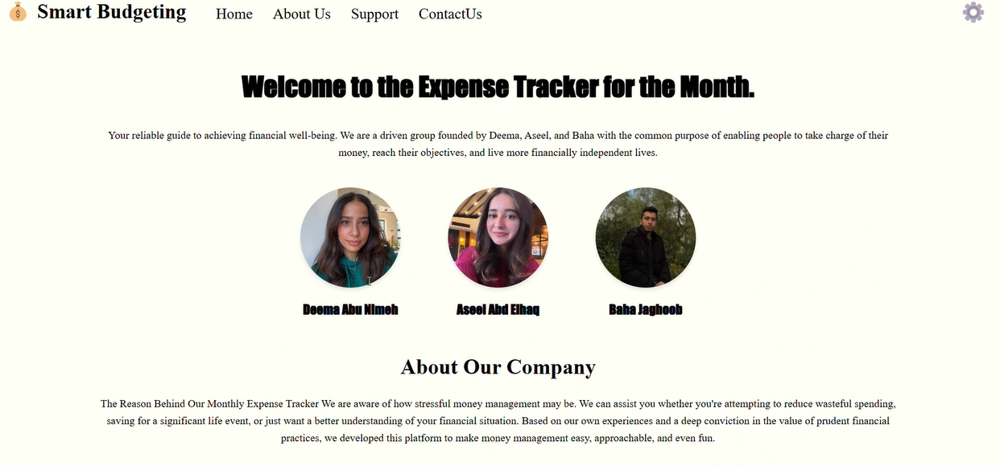
</p>

<p align="center">
  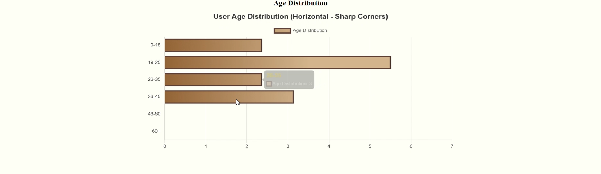
  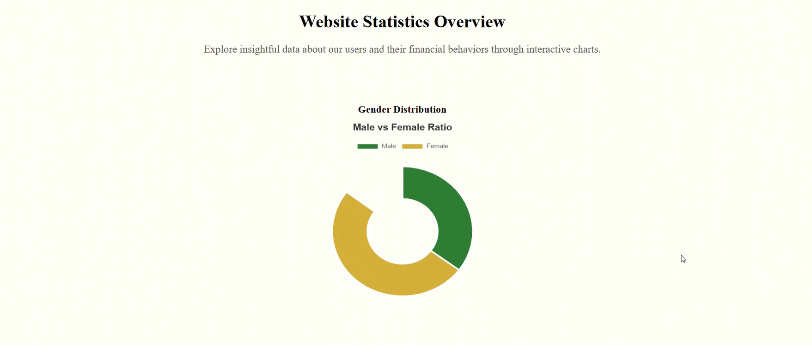
  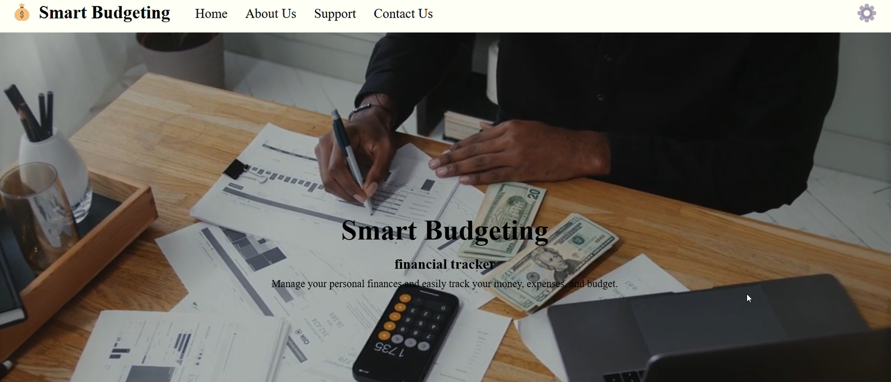
 
</p>

---

## ▶️ Demo
🎥 Watch the demo video here:  
[](https://www.linkedin.com/posts/aseel-abd-elhaq-7a446b318_excited-to-share-our-new-web-platform-smart-activity-7295555212063174656-2dPL?utm_source=social_share_send&utm_medium=member_desktop_web&rcm=ACoAAFCDpKwBdcIMOJcEcNAXEFOsdi0budJgmlU)

---

## 🚀 Getting Started

### Prerequisites
- Node.js & npm  
- MongoDB (local or Atlas cluster)  
- Browser (Chrome/Firefox recommended)  

### Run Locally
1. Clone this repo  
   ```bash
   git clone https://github.com/your-username/smart-budgeting.git
